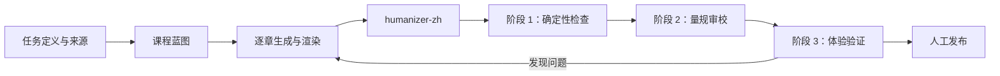

# Teach Yourself Skill

用于把课程当作可验证、可迭代的教学产品：先定义任务与来源，再规划、生成、质检并发布 Markdown/HTML 课程。它提供六类正文写法、课程评价量规与无外部依赖的确定性检查器。

## 内容

```text
teach-yourself-skill/
├── SKILL.md                 # Agent 工作流
├── scripts/                 # 第一阶段确定性质检与测试
├── references/              # 评价量规、写法指引、讲师风格与依赖约定
├── templates/               # 可组合的章节结构模板（可自行扩充）
└── examples/
    └── high-quality-ai-code-review/  # 完整案例课程
```

## 使用

将本目录安装到 Codex 的 skills 根目录，或在任务中显式引用其 `SKILL.md`。课程生成、改写、审阅和发布时使用 `$teach-yourself-skill`。

第一阶段检查不需要安装依赖：

```bash
node scripts/validate-course.mjs examples/high-quality-ai-code-review
node --test scripts/validate-course.test.mjs
```

`examples/high-quality-ai-code-review` 是一门 9 章的静态课程案例，包含任务定义、来源、蓝图、Markdown/HTML 产物、参考资料与质量报告。可直接用浏览器打开其 `index.html`。

## 必需的协作 Skill：humanizer-zh

中文学生可见文本需要通过 [Humanizer-zh](https://github.com/op7418/Humanizer-zh) 的语言质量闸门。Skill 系统目前没有可在 frontmatter 中声明并自动安装另一个 Skill 的通用机制；因此本仓库将它作为**显式运行时依赖**写入 [依赖说明](references/humanizer-dependency.md) 和 `SKILL.md`。

安装时，将 `teach-yourself-skill` 与 `humanizer-zh` 放在同一个 skills 根目录：

```text
<skills-root>/
├── teach-yourself-skill/
└── humanizer-zh/
```

获取或安装 `humanizer-zh`： [op7418/Humanizer-zh](https://github.com/op7418/Humanizer-zh)。

未安装 `humanizer-zh` 时，可进行课程规划和确定性检查，但不能声称中文课程已通过完整质量闭环。

## 自定义模板

`templates/` 仅保留通用、可组合的章节结构，不包含完整课程写法样例。请按课程领域、受众、合规要求和已有材料自行新增或维护模板文件；不要把私有项目名、内部架构、真实数据或受限材料提交到本仓库。


## 开源流程概览


